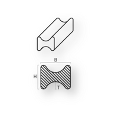

# Dog bones

## Introduction
The dog bones are used to make ventilation channels when windings are present around the entire perimeter of the coil. They are also sometimes used as additional reinforcement in the case of front-only or side-only channels made from steel ducts.
ali o solo laterali realizzati mediante distanziatori in acciaio.

### Table fields (Dog bones)

- **Code**: it is the code by which the type of dog bone is identified. Current abbreviation = STTR.
Other shapes may be defined when applications are customised.
- **Material**: material abbreviation. By opening the drop-down menu of the ***Material field***, you see a list of all available materials and can choose the correct abbreviation.
- **Width**: width of the dog bone (Dimension H in the drawing above).
- **Thickness**: the thickness of the dog bone. Corresponds to the thickness of the channel (Dimension B in the drawing above).
- **R**: corresponds to the outer radius and may be omitted.
- **R1**: corresponds to the inner radius and can be omitted.
- **Weight kg / m**: enter the value retrieved from the supplier's table.
- **Article**: to select the material, use the article code of your management system. This value will allow the applications to retrieve the description and unit cost into the table Material Unit Cost by importing the list of materials available in your warehouse.
