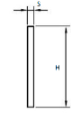

# Flat profiles

## Introduction
Flat profiles can be used for the horizontal clamping of elements.  
They are steel plates (as shown in the drawing above).  They differ from each other mainly in the type of material. The choice depends essentially on the installation environment. They are semi-finished products.

### Table fields (Flat profiles)
- **Code**: the code defines the shape of the profile, normally = PGP. Different profile shapes can be defined during customisation and different codes will be defined accordingly.
- **Material**: material abbreviation. By opening the drop-down menu of the Material field, you see a list of all available materials and can choose the correct abbreviation.
- **Width**: the width of the profile (Dimension H of the drawing above).
- **Thickness**: the thickness of the profile (Dimension S of the drawing above).
- **Weight kg/m**: weight per meter. Value to be retrieved from supplier's table.
- **Article**: to select the material, use the article code of your management system. This value will allow the applications to retrieve the description and unit cost into the table Material Unit Cost by importing the list of materials available in your warehouse.
