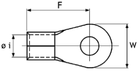

# Lugs

## Introduction
Non-insulated cable lugs are used in Clever Transfo and Clever Inductor applications as output terminals when current or other parameters do not permit the use of terminal blocks. They can be fixed to insulators or a plate.

### Table fields (Lugs)
- **Material**: here we do not refer to the material abbreviation list, but enter AL in the case of aluminium or CU in the case of copper.
- **The section in mm2**: usable section. It refers to the maximum section of the conductor to be inserted.
- **Type**: abbreviation by which the lug is identified (can be the supplier's abbreviation).
- **Rating current A**: maximum supported current.
- **Hole diameter**: diameter of the hole into which the conductor will be inserted ( &Oslash; i) as per drawing.
- **Article**: to select the material, use the article code of your management system. This value will allow the applications to retrieve the description and unit cost into the table Material Unit Cost by importing the list of materials available in your warehouse.
