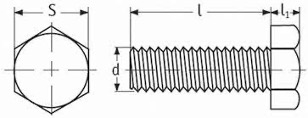

# Screws

## Introduction
Screws have many uses: horizontal clamping, ground screws, fixing output terminals, fixing plates or insulators etc.

### Table fields (Screws)

- **Code**: this code is particularly useful for possible sub-families. The used codes are as follows: 
TE = Hexagon head screw 
TC = Hexagon head screw 
- **Dimension M**: dimension d in the drawing above.
- **Screw length**: dimension l in the drawing above.
- **Material**: material abbreviation. By opening the drop-down menu of the Material field, you see a list of all available materials and can choose the correct abbreviation.
- **Article**: to select the material, use the article code of your management system. This value will allow the applications to retrieve the description and unit cost into the table Material Unit Cost by importing the list of materials available in your warehouse.
