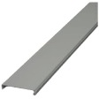

# Distanziatori

## Introduction
Steel ducts are used for the formation of **front or side** cooling channels in transformer or inductor windings. They are not suitable for channels along the entire perimeter of the coil. The shape is generally C-shaped as shown in the figure above and there are C-shaped variants with rounded edges.
They can be made of Ac Zn for transformer core/coil channels. In all other cases, the recommended material is AC 18/10 stainless steel. 

### Table fields (steel ducts)

- **Material**: material abbreviation. By opening the drop-down menu of the Material field, you see a list of all available materials and can choose the correct abbreviation.
- **Number**: the number of steel ducts used for a channel. For standardisation reasons, it is possible to place 2 or even 3 steel ducts side by side in order to achieve the desired channel width. Normally this value is 1.
- **Core width**: width of the core column on which the winding is made.
- **Width**: width of the steel duct.
- **Length**: length of the steel duct. If the steel duct is made from a sheet of metal with a length > the height of the windings. This measurement can be omitted.
- **Thickness**: the thickness of the steel sheet from which the steel ducts is cut.
- **Channel**: the thickness of the cooling channel that the steel duct produces.
- **Article**: To select the material, use the article code of your management system. This value will allow the applications to retrieve the description and unit cost into the table ***Material Unit Cost*** by importing the list of materials available in your warehouse.
