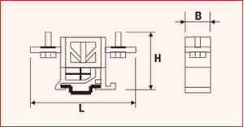

# Terminal blocks ST

## Introduction
This table contains the terminal block used in Clever Small-T and Clever Small-I applications as output terminals when current and other parameters allow their use. Please note that this table is not suitable for Clever Transfo and Clever Inductor applications that use the **“Terminal blocks”** table. The terminal blocks can be attached directly to the clamping profiles (clamps in lists) or on a rail, which in turn, is attached to the profile, as in the drawing above. There are various types of terminal blocks; you can distinguish among them by the field **Code**.

### Table fields (Terminal blocks ST)
- **Category**: defines which category of elements the terminal block can be used on. If the terminal block can be used for more than one category, they must all be listed, separating them with a dash in the middle.
***Example: 
UL-GENERIC***
- **Conductor**: admitted conductor material. If both aluminium and copper are used, CUAL must be entered, otherwise, input the abbreviation for only one conductor.
- **Nr. poles**: applies to multiple terminals blocks. It is important to enter this information for the calculation of the size of the terminal on the clamping profile.
- **Rating current A**: maximum supported current.
- **UL volt. rating V**: supported voltage in the case of UL category
- **Volt rating V**: supported voltage for other categories
- **Section in mm2**: usable section. Refers to the maximum cross-section of the conductor to be inserted.
- **Width**: the thickness of the individual terminal block (Dimension B in the drawing above)
- **Height**: height of the terminal block (Dimension H in the drawing above)
- **Length**: the maximum length of the terminal block (Dimension L in the drawing above)
- **Hole diameter**: diameter of the conductor entry hole.
- **Code**: acronym by which the type of terminal is identified.
***Example:
Binary = Terminal block on Omega rail***
If other terminal types are to be used during customisation, please contact us for the choice of code.
- **Article**: to select the material, use the article code of your management system. This value will allow the applications to retrieve the description and unit cost into the table Material Unit Cost by importing the list of materials available in your warehouse.
