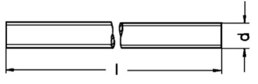

# Threated rod
## Introduction
Threaded rods are used in Clever Transfo and Clever Inductor applications for horizontal and vertical clamping of elements. The material is, generally, galvanized steel.

### Table fields (Threaded rods)
- **Length**: it is the length of the semi-finished product. You can enter 0 as this value is currently not available.
- **Weight kg/m**: this value is generally taken from the supplier's specifications and is mandatory .
- **Code**: this code is useful for possible sub-families. Currently, the code AS0 must be used for all threaded rods (the last character is a zero).
- **Material**: material abbreviation. By opening the drop-down menu of the Material field, you see a list of all available materials and can choose the correct abbreviation.
- **Dimension M**: enter here the M value corresponding to dimension 'd' in the drawing above.
- **Article**: to select the material, use the article code of your management system. This value will allow the applications to retrieve the description and unit cost into the table ***Material Unit Cost*** by importing the list of materials available in your warehouse.