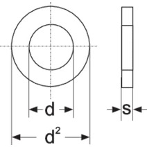

# Washers

## Introduction
Washers are used in horizontal and vertical clamping, in ground-screw clamping and clamping of output terminals (lugs or bars) on plates or insulators.

### Table fields (Washers)

- **Code**: these are acronyms by which the shape of the washer is identified. The current abbreviations are:
RGR = Grower washer  
RPN = Flat washer  
RPNL = Wide flat washer.  
Other shapes could be defined when customising applications.
- **Dimension M**: M of the screw or threaded rod with which the washer can be used.
- **Material**: material abbreviation. By opening the drop-down menu of the Material field, you see a list of all available materials and can choose the correct abbreviation.
- **Internal diameter**: corresponds to dimension d in the drawing above.
- **External diameter**: corresponds to dimension d2 of the drawing above.
- **Thickness**: corresponds to dimension s in the drawing above.
- **Article**: to select the material, use the article code of your management system. This value will allow the applications to retrieve the description and unit cost into the table Material Unit Cost by importing the list of materials available in your warehouse.

