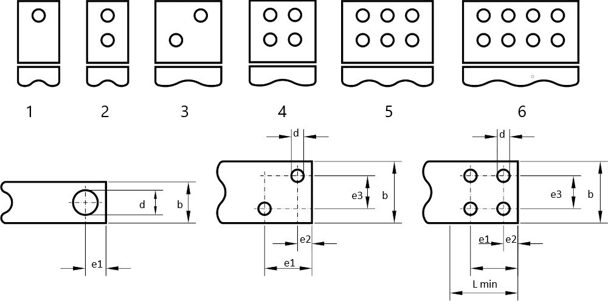

# Forature barre

## Introduzione
Questa tabella presenta le forature standard delle barre d’uscita, lato attacco cliente, secondo DIN 43673.
La figura  mostra i tipi di foratura, che sono complessivamente 6 e le quote riportate in tabella, che si ripetono anche nelle forature 5 – 6 . In fase di esecuzione del progetto, è possibile scegliere il tipo di foratura e le applicazioni considereranno le quote della tabella, che possono poi essere a loro volta modificate. Resta il fatto che se modificherete le quote, non sarete più in linea con le Norme DIN.

### Campi della tabella (Foratura barre)

- **Largh. barra**: dimensione **b** del disegno.
- **Lungh. minima barra**: dimensione **L min.** del disegno. Si tratta della lunghezza minima che occorre lasciare a disposizione per l’attacco del cliente.
- **Diametro foro**: dimensione **d** del disegno. Tutti i fori sono uguali.
- **Dim. E1**: distanza tra i fori: dimensione **e1** del disegno.
- **Dim. E2**: distanza tra i fori: dimensione **e2** del disegno.
- **Dim. E3**: distanza tra i fori: dimensione **e3** del disegno.
- **Dim. A**: campo per utilizzo futuro. Inserire 0. 
- **Tipo foratura**: vedi disegno in alto
- **Numero fori**: nr. fori sulla barra. Il numero dei fori è implicito scegliendo una certa foratura, ma lo si riporta per chiarezza.
