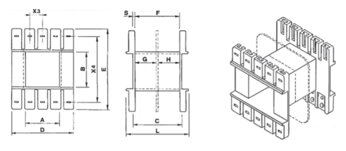

# Rocchetti

## Introduzione
Questa tabella di rocchetti viene utilizzata dalle applicazioni per gli elementi generici, mentre per gli elementi che devono sottostare alle norme UL esiste una tabella apposita. 

### Campi della tabella (Rocchetti)
- **Codice**:
Sigla con la quale viene identificato il tipo di lamierino stampato che può montare il rocchetto.
- **Tipo**: definizione del rocchetto: A x B (vedi disegno)
- **Larghezza lamierino**: larghezza della colonna del lamierino sulla quale il rocchetto viene montato (Dimensione B nel disegno).
- **Spess. nucleo**: spessore a disposizione per il nucleo (Dimensione B nel disegno).
- **H avvolgimento**: altezza a disposizione per l’avvolgimento (Dimensione F nel disegno).
- **Spess. avv**: spazio disponibile per l’avvolgimento.
- **Spess. frontale**: spazio disponibile lato uscite.
- **Peso gr.**: inserire il valore recuperato dalla tabella del fornitore.
- **Materiale**: sigla del materiale. Aprendo il menu a tendina del campo Materiale vedete l’elenco di tutti i materiali disponibili e potete scegliere la sigla corretta.
- **Articolo**: inserire il codice articolo che questo materiale ha assunto nel vostro sistema gestionale. Questo valore permetterà alle applicazioni di recuperare la descrizione e il costo unitario sulla tabella “Costo unitario Materiali” nella quale viene importata la lista dei materiali presenti nel vostro magazzino.
