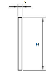

# Profili piatti

## Introduzione
I profili piatti possono essere utilizzati per il serraggio orizzontale degli elementi.  
Sono piastre in acciaio (come da disegno).  Si differenziano tra di loro essenzialmente per il tipo di materiale. La scelta dipende essenzialmente dall’ambiente d’installazione. Sono prodotti semilavorati.

### Campi della tabella (Profili piatti)
- **Codice**: il codice definisce la forma del semilavorato, normalmente = PGP. Durante la personalizzazione è possibile definire profili di forme differenti e di conseguenza si definiranno codici diversi.
- **Materiale**: sigla del materiale. Aprendo il menu a tendina del campo Materiale vedete l’elenco di tutti i materiali disponibili e potete scegliere la sigla corretta.
- **Larghezza**: larghezza del semilavorato (Dimensione H del disegno).
- **Spessore**: spessore del semilavorato (Dimensione S del disegno).
- **Peso kg/m**: peso al metro. Valore da recuperare dalla tabella del fornitore.
- **Articolo**: inserire il codice articolo che questo materiale ha assunto nel vostro sistema gestionale. Questo valore permetterà alle applicazioni di recuperare la descrizione e il costo unitario sulla tabella “Costo unitario Materiali” nella quale viene importata la lista dei materiali presenti nel vostro magazzino.
