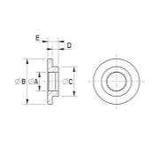

# Bussole isolanti

## Introduzione
Le bussole isolanti si utilizzano nelle applicazioni Clever Small-T e Clever Small-I per l’isolamento delle viti nel serraggio orizzontale. Possono essere sostituite da tubetti isolanti se richiesto. Nella tabella sono stati inseriti alcuni campi che, attualmente, non vengono utilizzati e quindi devono avere valore 0. 

### Campi della tabella (Bussole)
- **Diametro esterno**: dimensione B del disegno. Questo valore non viene utilizzato inserire **0**.
- **Diametro collare**: dimensione C del disegno. Questo valore non viene utilizzato inserire **0**.
- **Spessore**: dimensione D del disegno. Questo valore non viene utilizzato inserire **0**.
- **Lunghezza**: dimensione E del disegno. Questo valore non viene utilizzato inserire **0**.
- **Dimensione M**: dimensione A del disegno. Inserire qui il valore **M**.
- **Materiale**: sigla del materiale. L’associazione delle sigle alla descrizione estesa del materiale è descritta nella tabella “Nomi dei materiali”.
- **Codice**: questo codice è utile per eventuali sotto-famiglie. Al momento occorre utilizzare come codice **BUI** per tutte le bussole.
- **Articolo**: inserire il codice articolo che questo materiale ha assunto nel vostro sistema gestionale. Questo valore permetterà alle applicazioni di recuperare la descrizione e il costo unitario sulla tabella “Costo unitario Materiali” nella quale viene importata la lista dei materiali presenti nel vostro magazzino.
