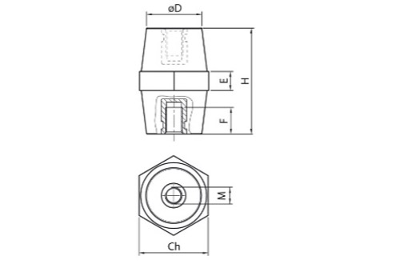

# Isolatori

## Introduzione
Gli isolatori, si utilizzano per isolare e fissare all’elemento i terminali d’uscita.
Generalmente vengono impiegati in presenza di tensioni di isolamento o di esercizio che superano 4 KV, oppure quando il basso numero di uscite rende più economico utilizzarli al posto di una piastra per fissare capicorda o sbarrette. Esistono molti tipi di isolatori, molto differenti tra di loro. Qui è stato inserito un isolatore standard. In fase di personalizzazione è possibile inserire tabelle di isolatori anche molto differenti da questi.

### Campi della tabella (Isolatori)

- **Codice**: codice che identifica il tipo di golfare. Il golfare standard rappresentato nel disegno corrisponde a GF. 
Quello con foro filettato all’esterno corrisponde a GM.
- **Tensione esercizio V**: tensione nominale massina supportata.
- **Diametro esterno**: diametro esterno **D**. Vedi disegno.
- **Altezza**: altezza isolatore **H**. Vedi disegno.
- **Tipo**: nome dell’isolatore. Generalmente il nome che gli dà il fornitore.
- **Larghezza**: larghezza in chiave dell’isolatore **Ch**. Vedi disegno.
- **Prof. filetto inf**: profondità filetto **F**. Vedi disegno.
- **M vite inferiore**: dimensione **M** della filettatura interna inferiore. Vedi disegno.
- **Prof. filetto superiore**: profondità del filetto superiore. Il foro superiore potrebbe non esistere, a seconda del modello dell’isolatore.
- **M vite superiore**: dimensione **M** della filettatura interna superiore. Il foro superiore potrebbe non esistere, a seconda del modello dell’isolatore.
- **Forza NM**: campo per usi futuri. Non compilare.
- **Standard**: inserire **SI** se le dimensioni sono standard, ossia fanno parte di una serie STD del fornitore.
- **Articolo**: inserire il codice articolo che questo materiale ha assunto nel vostro sistema gestionale. Questo valore permetterà alle applicazioni di recuperare la descrizione e il costo unitario sulla tabella “Costo unitario Materiali” nella quale viene importata la lista dei materiali presenti nel vostro magazzino.
