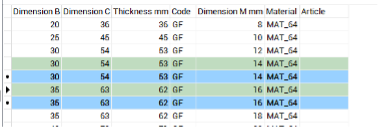

# Modalità di interazione con le tabelle

### Ingrandire o ridurre la sezione di help: 
Premere CTRL e contemporaneamente: + per ingrandire   
– per rimpicciolire

### Filtrare dati nelle tabelle:
In alto a sinistra di ogni tabella trovate il box di filtro.
  
Scrivete la parola che desiderate venga filtrata. Facendo click sulle rotelline azzurre potrete scegliere se la parola deve essere un inizio oppure se deve essere contenuta nei campi di ricerca.

### Ordinare i dati nelle tabelle:
Fate click sulla colonna da mettere in ordine alfabetico.
Se desiderate creare altri ordinamenti all’interno dell’ordinamento principale, tenete premuto il tasto Ctrl e fate click sulle colonne nella successione preferita.

***Esempio:  
Tabella : Conduttori  
Se fate click su **Codice** la tabella viene ordinata per tipo di conduttore se, a questo punto, tenendo premuto il tasto Ctrl fate click sulla colonna **Sezione mm2**, ciascun tipo di conduttore  verrà ordinato per sezione…ecc.***

### Navigare tra i dati delle tabelle:

  

Utilizzate il navigatore il alto a destra in questo modo: 
per andare alla prima riga della tabella 
per andare alla riga precedente 
per andare alla riga seguente 
per andare all’ultima riga 
rispettivamente per aggiungere una riga e togliere la riga selezionata nella tabella.

### Selezionare e cancellare più righe simultaneamente:
Per selezionare più righe posizionatevi sulla prima riga (sul rettangolino a sinistra), tenete premuto il tasto CTRL e selezionate le righe successive.  
Una volta selezionate le righe fate click sull’icona   
L’applicazione chiederà conferma.

### Duplicare righe:
Selezionate le righe come descritto al punto precedente 

Click su   le righe appariranno come nella figura qui sotto: 

Le righe verdi sono quelle duplicate e quindi da modificare.  

**Attenzione perché il contenuto delle varie righe deve essere univoco altrimenti riceverete un errore quando premete Aggiorna**

### Esportazione dati su Excel:  
- Selezionate i campi che desiderate esportare e premete 
- Aprite Excel
- Posizionatevi nel punto di inserimento
- Fate click su incolla

### Importazione dati da Excel: 
- Da Excel selezionate i dati da importare e premete Copia
- Tornate nell’applicazione e fate click su    
  
**Attenzione: la successione dei campi deve essere identica a quella della tabella sulla quale state copiando altrimenti otterrete un errore.**

### Confermare o annullare le modifiche:
Per annullare tutte le modifiche premete il bottone **Annulla** in basso a sinistra.
Per confermare tutte le modifiche premete il bottone **Aggiorna** in basso a destra

