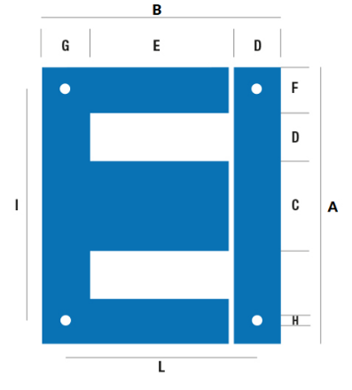

# Lamierini stampati

## Introduzione
In questa tabella si inseriscono i lamierini stampati a disposizione.  

### Campi della tabella (Lamierini Stampati)

- **Lamierino**: tipo di lamierino.  
***Esempio: EI.***
- **Codice**: in questo caso occorre inserire la sigla della qualità del lamierino, facendo attenzione che sia scritta correttamente, come da tabella materiali.
- **A**: inserire la larghezza del lamierino (Dimensione A del disegno).
- **B**: inserire l’altezza totale del nucleo (Dimensione B del disegno).
- **C**: inserire la larghezza della colonna centrale (Dimensione C del disegno).
- **D**: inserire la larghezza della finestra del lamierino (Dimensione D del disegno).
- **E**: inserire l’altezza della finestra del lamierino (Dimensione E del disegno).
- **F**: inserire la larghezza della colonna laterale del lamierino (Dimensione F del disegno).
- **Diametro foro**: inserire il diametro dei fori per il passaggio dei tiranti di serraggio.
- **Articolo**: inserire il codice articolo che questo materiale ha assunto nel vostro sistema gestionale. Questo valore permetterà alle applicazioni di recuperare la descrizione e il costo unitario sulla tabella “Costo unitario Materiali” nella quale viene importata la lista dei materiali presenti nel vostro magazzino.
