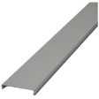

# Distanziatori

## Introduzione
I Distanziatori si utilizzano per la formazione di canali di raffreddamento **frontali o laterali** negli avvolgimenti  di trasformatori o induttori. Non sono adatti per canali lungo tutto il perimetro della bobina. La forma è generalmente a U come quella della figura, esistono varianti a C con gli spigoli arrotondati.
Possono essere in Ac Zn per i canali nucleo/bobina dei trasformatori. In tutti gli altri casi il materiale consigliato è AC inox 18/10.

### Campi della tabella (Distanziatori)

- **Materiale**:
Sigla del materiale. Aprendo il menu a tendina del campo Materiale vedete l’elenco di tutti i materiali disponibili e potete scegliere la sigla corretta.
- **Numero**: numero dei distanziatori impiegati per un canale. È possibile infatti, per ragioni di standardizzazione, affiancare 2 o anche 3 distanziatori allo scopo di ottenere la larghezza del canale desiderata. Normalmente questo valore è 1.
- **Largh. Lam**: larghezza del lamierino della colonna sulla quale viene eseguito l’avvolgimento.
- **Larghezza**: larghezza del distanziatore.
- **Lunghezza**: lunghezza del distanziatore. Se il distanziatore si ricava da un semilavorato di lunghezza > dell’altezza degli avvolgimenti, questa misura si può omettere.
- **Spessore**: spessore del foglio di acciaio dal quale viene ricavato il distanziatore.
- **Canale**: spessore del canale di raffreddamento che il distanziatore realizza.
- **Articolo**: inserire il codice articolo che questo materiale ha assunto nel vostro sistema gestionale. Questo valore permetterà alle applicazioni di recuperare la descrizione e il costo unitario sulla tabella “Costo unitario Materiali” nella quale viene importata la lista dei materiali presenti nel vostro magazzino.
