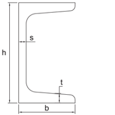

# Profili a U

## Introduzione
I profili a U possono essere utilizzati per il serraggio verticale degli elementi oppure come profilo di base.  
Possono essere in acciaio piegato o UNP (come da disegno)  Si differenziano tra di loro essenzialmente per il tipo di materiale. La scelta dipende essenzialmente dall’ambiente d’installazione. Sono prodotti semilavorati.

### Campi della tabella (Profili a U)
- **Codice**: il codice definisce la forma del semilavorato, normalmente = UG. Durante la personalizzazione è possibile definire profili di forme differenti e di conseguenza si definiranno codici diversi.
- **Materiale**: sigla del materiale. Aprendo il menu a tendina del campo Materiale vedete l’elenco di tutti i materiali disponibili e potete scegliere la sigla corretta.
- **Larghezza**: larghezza del semilavorato (Dimensione H del disegno).
- **Altezza**: altezza del semilavorato (Dimensione B del disegno).
- **Spessore 1**: spessore 1 del semilavorato (Dimensione S del disegno).
- **Spessore 2**: spessore 1 del semilavorato (Dimensione T del disegno).
- **Peso kg/m**: peso al metro. Valore da recuperare dalla tabella del fornitore.
- **Articolo**: inserire il codice articolo che questo materiale ha assunto nel vostro sistema gestionale. Questo valore permetterà alle applicazioni di recuperare la descrizione e il costo unitario sulla tabella “Costo unitario Materiali” nella quale viene importata la lista dei materiali presenti nel vostro magazzino.
